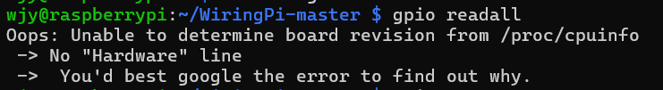
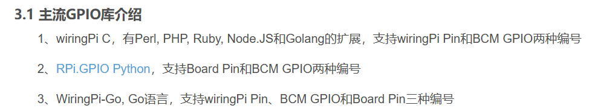
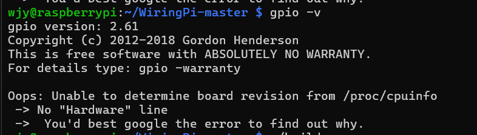
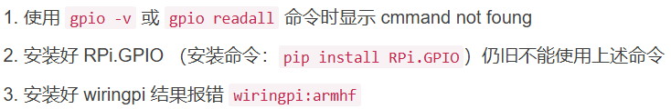
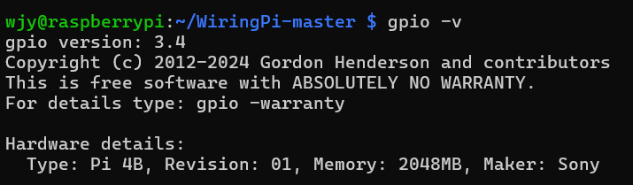
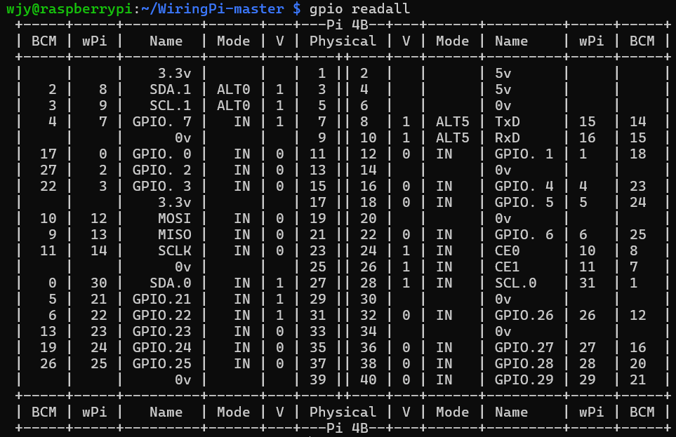

**前言**

之前有个问题困扰了我很久，就是我想用gpio指令的时候总是会报这个错：

然后上网查的解决方法也没有解决这个问题，但是也不影响gpio库的使用（大概是因为当时所编写的都是py文件），所以当时就没有管了。
但是这两天在学i2c的时候，这个问题似乎影响了很多。就是我想编译和安装驱动程序的时候总是报错（驱动程序是.c文件），这似乎和之前遇到的问题链接起来了：**wiringpi的问题**。

但是之前我也是有装wiringpi的呀，显示gpio版本也会显示2.61，但是依旧跟着那个"Hardware"的报错，就很恶心

直到我看到了这篇文档：

http://t.csdnimg.cn/FoOjb

这个症状，简直和我一模一样！

按理来说，树莓派4B自带2.5版本的wiringpi，无法映射到gpio，所以只要像虞博超文档里那样upgrade一下，然后再下个python版本的RPi.GPIO库就能进行正常的py程序编写（但是我今天找的代码刚好就是C，以前的gpio库已经不能满足这个需求了，所以问题又回到了wiringpi。）

说了这么多废话，所以wiringpi到底有啥问题呢———

虽说我不是pip下的wiringpi是直接更新的，但是效果应该差不多，就是64位的树莓派不兼容armhf架构的wiringpi，所以说，得下适合64位ARM架构的wiringpi。
嗯，然后我就试图从github上拉取目标wiringpi，但是，pc端科学上网好像对树莓派无效啊，然后，在王tc同学的指点下，我直接在pc端下载安装包，然后用scp复制到树莓派上，然后解压，build一下，终于——！！！

gpio指令终于可以用了！！完结撒花！！！（不对，所以i2c还是没有学完吧，，
总之，虽然这个wiringpi和学习内容关系不是特别大，但毕竟怎么说也是踩了一个坑（只因那个驱动文件是c吧），然后也是花费了两个晚上才解决，所以还是决定记录一下（也是写了一篇vsdn了（乐