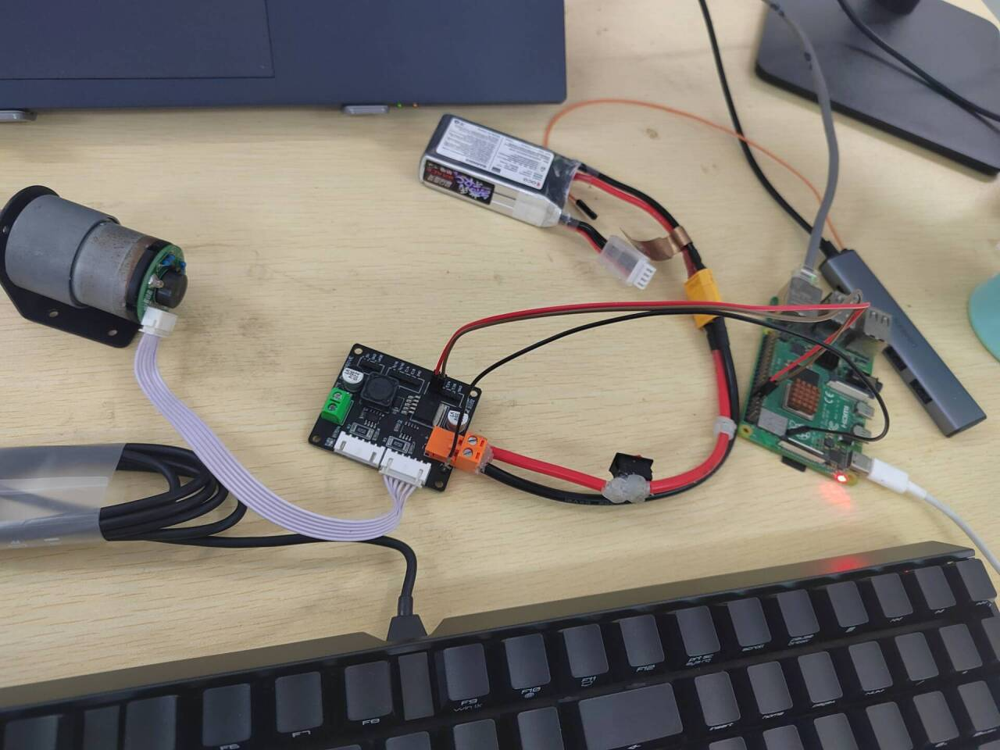

# 用树莓派引脚控制直流电机正反转

## 先上效果：

<video controls src="电机正反转.mp4" title="Title"></video>

可以实现电机以50的占空比**正转**后休息两秒，再以75的占空比**反转**后休息两秒，然后停止转动。

## 硬件连接：
### 材料：
- 树莓派4B
- 电池
- 小开关
- A4950电机驱动
- 直流电机
- 各种线若干
  
### 连接：
电池通过驱动和线给电机供电，树莓派的pin11、pin12连接驱动的bin1、bin2。

实物图：



## 代码：
```
import RPi.GPIO as GPIO
import time

# 设置 GPIO 引脚编号模式为 BCM 模式
GPIO.setmode(GPIO.BCM)

# 定义电机控制引脚
MOTOR_A1 = 17
MOTOR_A2 = 18

# 设置电机控制引脚为输出模式
GPIO.setup(MOTOR_A1, GPIO.OUT)
GPIO.setup(MOTOR_A2, GPIO.OUT)

# 设置 PWM 引脚和频率
pwm_frequency = 1000  # PWM 频率为 1000Hz
pwm_A1 = GPIO.PWM(MOTOR_A1, pwm_frequency)
pwm_A2 = GPIO.PWM(MOTOR_A2, pwm_frequency)

# 启动 PWM
pwm_A1.start(0)  # 初始占空比为 0%
pwm_A2.start(0)

# 定义正转函数
def forward(speed):
    pwm_A1.ChangeDutyCycle(speed)
    pwm_A2.ChangeDutyCycle(0)

# 定义反转函数
def backward(speed):
    pwm_A1.ChangeDutyCycle(0)
    pwm_A2.ChangeDutyCycle(speed)

# 定义停止函数
def stop():
    pwm_A1.ChangeDutyCycle(0)
    pwm_A2.ChangeDutyCycle(0)

# 控制电机转速
forward(50)  # 正转，50% 的占空比
time.sleep(2)  # 等待 2 秒
backward(75)  # 反转，75% 的占空比
time.sleep(2)  # 等待 2 秒
stop()  # 停止

# 停止 PWM
pwm_A1.stop()
pwm_A2.stop()

# 清理 GPIO 引脚
GPIO.cleanup()
```
## 后记：
大概就是这样了，感谢xqw和各位好同学的倾心帮助！
