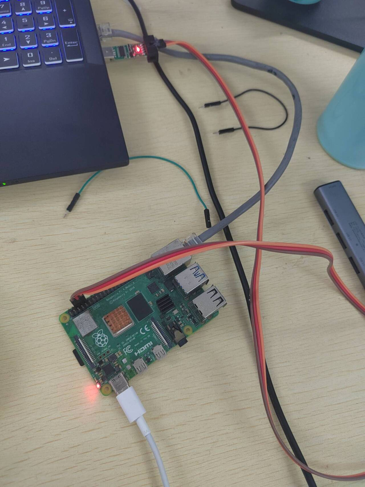
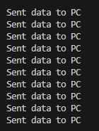
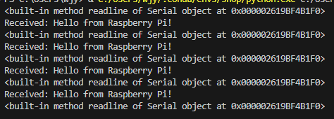
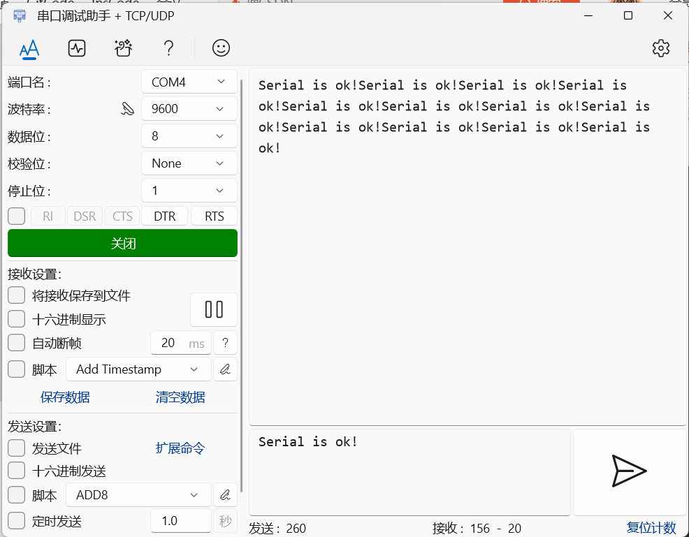

# **在树莓派上使用串口与计算机通信：**

硬件连接：



树莓派发消息：
```
import serial
import time

port="/dev/ttyS0"
baudrate=9600
timeout=1

ser=serial.Serial(port,baudrate,timeout=timeout)

try:
    while True:
        ser.write(b'Hello from Raspberry Pi!\n')
        print("Sent data to PC")
        time.sleep(1)

except KeyboardInterrupt:
    ser.close()
```
终端:



pc端收：
```
import serial

port="COM4"
baudrate=9600
timeout=1

ser=serial.Serial(port,baudrate,timeout=timeout)

try:
    while True:
        # 从串口读取数据
        print(ser.readline)
        data = ser.readline().decode('utf-8').strip()
        if data:
            print("Received:", data)
except KeyboardInterrupt:
    ser.close() 
```

终端：



#
树莓派收消息：

```
import numpy
import serial
import time
 
 
def main():
    #length=mygpio.ama0_write('the serial is open successfully!\r\n')
    #print(length)
    com = serial.Serial('/dev/serial0', 9600, timeout=10)
    while True:
        time.sleep(2)
        stri = com.readline().strip()
        data = (stri.decode('utf-8'))#utf-8->unicode
        if len(data)>0:
            com.write(data.encode('ascii'))
        
    
if __name__=='__main__':
    main()
```

串口调试助手发：



